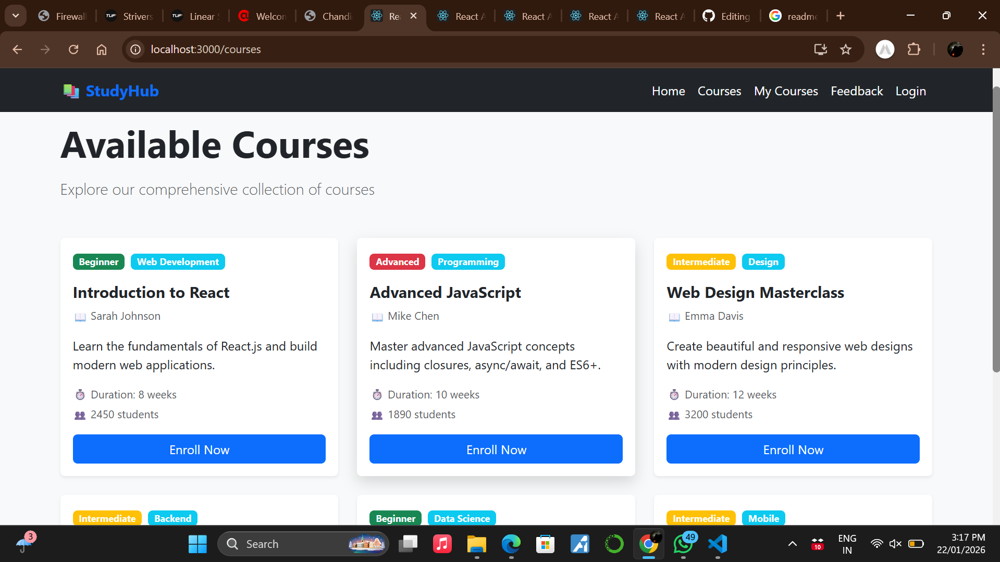
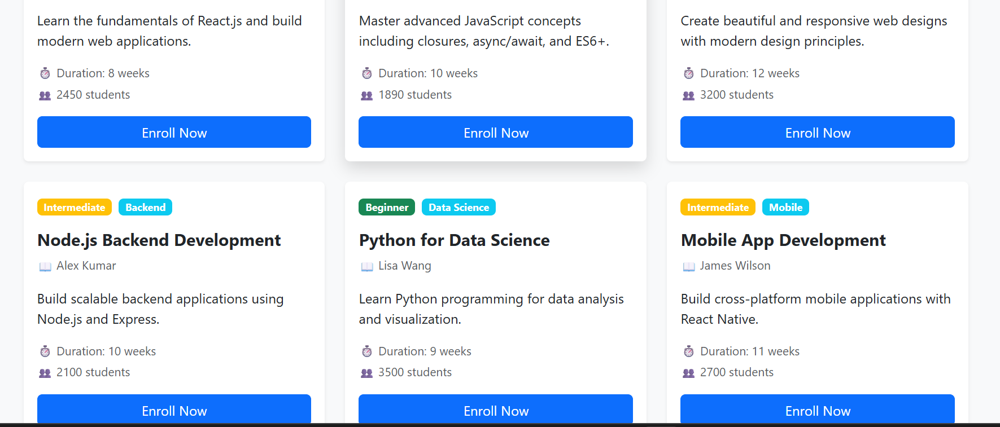
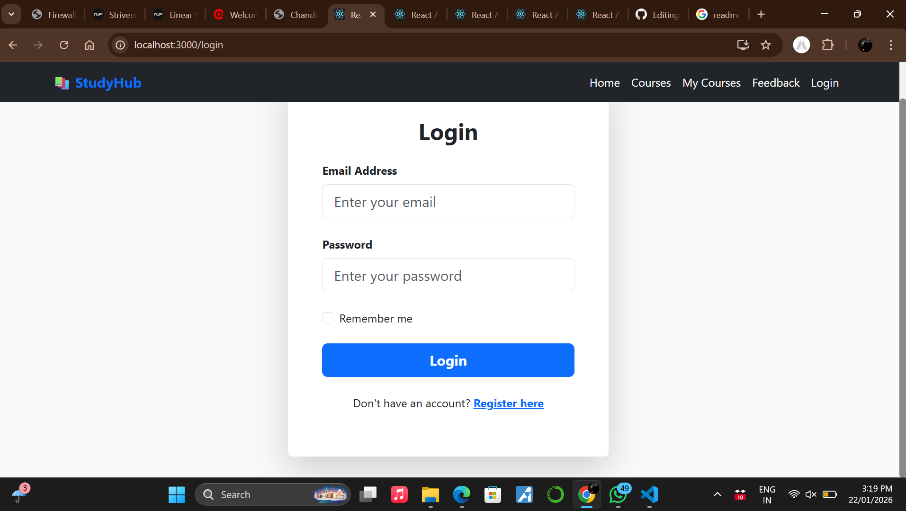
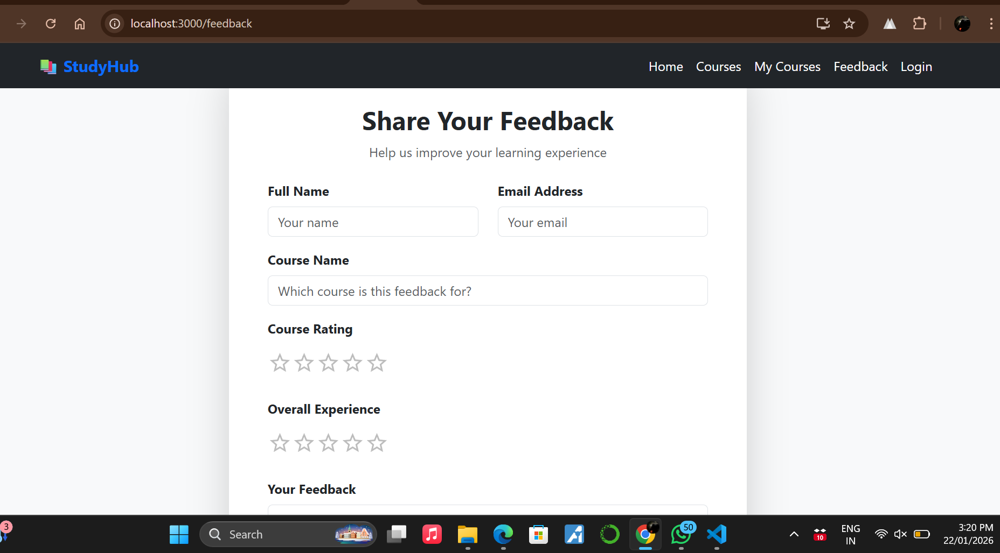

# 📚 Student Course Management Portal (Frontend)

A responsive single-page frontend application that allows students to discover, enroll in, and manage courses. Built with React, Bootstrap, and Material-UI components following modern UI/UX principles.

## 🎯 Project Overview

The Student Course Management Portal is a frontend-only application designed for educational institutions to provide students with a seamless learning experience. Students can browse available courses, enroll in them, track their progress, and provide feedback.

### Case Study Details
- **Title**: Student Course Management Portal (Frontend Only)
- **Type**: Single Page Application (SPA)
- **Framework**: React 19.2.3
- **UI Libraries**: Bootstrap 5, React-Bootstrap, Material-UI

---

## ✨ Features

### 1. **Course Discovery**
- Browse all available courses with detailed information
- Filter courses by level (Beginner, Intermediate, Advanced)
- View course details: instructor, duration, student count, description
- Real-time enrollment status tracking

### 2. **Course Enrollment**
- One-click enrollment in courses
- Prevent duplicate enrollments
- Visual feedback with "Enrolled ✓" status
- Color-coded difficulty levels

### 3. **Course Management**
- View all enrolled courses
- Track learning progress
- Access course materials and resources
- Continue learning from where you left off

### 4. **User Authentication (UI Only)**
- Login form with email and password validation
- User registration with password confirmation
- Form validation and error handling
- "Remember me" functionality

### 5. **Feedback System**
- Rate courses using 5-star ratings
- Provide detailed feedback messages
- Rate overall platform experience
- Submit feedback anonymously or with contact info

### 6. **Responsive Navigation**
- Sticky navigation bar
- Links to all main sections
- Mobile-friendly hamburger menu
- Quick access to my courses and feedback

### 7. **User Interface**
- Modern, clean design
- Hover effects and smooth transitions
- Card-based layouts
- Mobile-responsive (works on all devices)
- Consistent color scheme and typography

---

## 📋 Pages & Sections

### 1. **Home Page** (Landing Page)
- Hero section with welcome message
- Feature cards highlighting key benefits
- Call-to-action buttons
- Quick links to courses and registration

### 2. **Courses Page**
- Grid display of 6 featured courses
- Each course shows:
  - Course title and instructor
  - Description
  - Duration and difficulty level
  - Number of enrolled students
  - Enroll button
- Responsive layout (3 columns on desktop, 2 on tablet, 1 on mobile)

### 3. **My Courses Page** (Enrolled)
- Display of all enrolled courses
- Quick action buttons:
  - Continue Learning
  - View Progress
- Empty state message when no courses enrolled

### 4. **Login Page**
- Email and password input fields
- Remember me checkbox
- Link to registration page
- Form validation

### 5. **Register Page**
- First and last name inputs
- Email registration
- Password confirmation
- Terms and conditions agreement
- Password match validation
- Link to login page

### 6. **Feedback Page**
- Student information form
- Course rating (5-star system)
- Overall experience rating
- Feedback text area
- Form submission with confirmation

---

## 🚀 Getting Started

### Prerequisites
- Node.js (v14 or higher)
- npm (v6 or higher)
- A modern web browser

### Installation

1. **Clone the repository**
   ```bash
   git clone https://github.com/yourusername/student-course-portal.git
   cd student-course-portal
   ```

2. **Install dependencies**
   ```bash
   npm install
   ```

3. **Install additional packages** (if not already included)
   ```bash
   npm install react-router-dom bootstrap react-bootstrap @mui/material @emotion/react @emotion/styled
   ```

### Running the Application

1. **Start the development server**
   ```bash
   npm start
   ```

2. **Open in browser**
   - The app automatically opens at `http://localhost:3000`
   - Or manually navigate to: http://localhost:3000

3. **Make changes**
   - Edit files in the `src/` folder
   - The app hot-reloads automatically

### Building for Production

```bash
npm run build
```

This creates an optimized production build in the `build/` folder.

---

## 📸 Screenshots

### 1. Home Page - Landing Screen

*Beautiful landing page with hero section, feature highlights, and call-to-action buttons*

### 2. Courses Browsing Page

*Grid layout displaying 6 featured courses with enrollment options, difficulty levels, and instructor details*

### 3. Course Details & Enrollment

*Individual course cards showing full information with one-click enrollment functionality*

### 4. My Enrolled Courses

*Dashboard showing all courses user is enrolled in with progress tracking and learning options*

### 5. User Feedback Page

*Interactive feedback form with 5-star ratings for individual courses and overall experience*

### 6. Application Overview

*Complete application interface showcasing responsive design and navigation elements*

---

## 🏗️ Project Structure

```
student-course-portal/
├── public/
│   ├── index.html
│   ├── manifest.json
│   └── robots.txt
├── src/
│   ├── components/
│   │   └── NavbarComp.jsx       # Navigation bar component
│   ├── pages/
│   │   ├── Home.jsx              # Home/landing page
│   │   ├── Courses.jsx           # Browse courses
│   │   ├── Enrolled.jsx          # My enrolled courses
│   │   ├── Login.jsx             # Login form
│   │   ├── Register.jsx          # Registration form
│   │   └── Feedback.jsx          # Feedback form with ratings
│   ├── App.js                    # Main app component with routing
│   ├── App.css                   # Global styles
│   ├── index.css                 # Base styles
│   └── index.js                  # Entry point
├── package.json
├── README.md
└── .gitignore
```

---

## 🎨 Design Features

### UI/UX Elements Used
- **Bootstrap 5**: Responsive grid system, components, utilities
- **React-Bootstrap**: Bootstrap components as React components
- **Material-UI**: Cards, ratings, dialogs, icons
- **Custom CSS**: Animations, hover effects, custom styling

### Color Scheme
- **Primary**: #0d6efd (Blue)
- **Secondary**: #6c757d (Gray)
- **Success**: #198754 (Green)
- **Warning**: #ffc107 (Yellow)
- **Danger**: #dc3545 (Red)
- **Info**: #0dcaf0 (Cyan)

### Responsive Breakpoints
- **Mobile**: < 576px
- **Tablet**: 576px - 768px
- **Desktop**: 768px - 992px
- **Large Desktop**: > 992px

---

## 📦 Dependencies

### Core Dependencies
- `react` - React framework
- `react-dom` - React DOM rendering
- `react-router-dom` - Client-side routing
- `bootstrap` - Bootstrap CSS framework
- `react-bootstrap` - Bootstrap React components
- `@mui/material` - Material Design components
- `@emotion/react` - CSS-in-JS library
- `@emotion/styled` - Styled components for MUI

### Development Dependencies
- `react-scripts` - Create React App scripts
- `@testing-library/react` - React testing utilities
- `@testing-library/jest-dom` - DOM testing utilities

---

## 🔑 Key Functionalities

### State Management
- React Hooks (useState) for local state management
- Props passing for component communication
- Form data handling and validation

### Routing
- React Router v7 for navigation
- Dynamic route rendering
- Navigation links with active states

### Form Handling
- Controlled components
- Form validation
- Error messages and feedback
- Success notifications

### Interactive Features
- Course enrollment with duplicate prevention
- Star rating system
- Form submission handling
- Modal dialogs
- Dropdown menus

---

## 🎓 Sample Courses

The application includes 6 sample courses:

1. **Introduction to React** - Learn React fundamentals
2. **Advanced JavaScript** - Master advanced JS concepts
3. **Web Design Masterclass** - Create beautiful web designs
4. **Node.js Backend Development** - Build server applications
5. **Python for Data Science** - Learn data analysis with Python
6. **Mobile App Development** - Build cross-platform mobile apps

---

## 💡 Future Enhancements

- [ ] Backend API integration for real data
- [ ] User authentication with JWT tokens
- [ ] Database for courses and user data
- [ ] Advanced filtering and search
- [ ] Course progress tracking
- [ ] Video streaming integration
- [ ] Discussion forums
- [ ] Certificates upon completion
- [ ] Payment integration
- [ ] Admin dashboard

---

## 🤝 Contributing

Contributions are welcome! Please feel free to submit issues or pull requests.

### How to Contribute
1. Fork the repository
2. Create a feature branch (`git checkout -b feature/AmazingFeature`)
3. Commit your changes (`git commit -m 'Add some AmazingFeature'`)
4. Push to the branch (`git push origin feature/AmazingFeature`)
5. Open a Pull Request

---

## 📄 License

This project is licensed under the MIT License - see the LICENSE file for details.

---

## 👨‍💼 Author

Created as an educational project demonstrating React, Bootstrap, and Material-UI best practices.

---

## 📞 Support

For support, email support@example.com or open an issue on GitHub.

---

## 🔗 Useful Links

- [React Documentation](https://reactjs.org/)
- [Bootstrap Documentation](https://getbootstrap.com/docs/)
- [React-Bootstrap Documentation](https://react-bootstrap.github.io/)
- [Material-UI Documentation](https://mui.com/)
- [React Router Documentation](https://reactrouter.com/)

---

## 📊 Technical Stack Summary

| Category | Technology |
|----------|-----------|
| **Frontend Framework** | React 19.2.3 |
| **Routing** | React Router v7 |
| **UI Framework** | Bootstrap 5 |
| **Component Library** | React-Bootstrap, Material-UI |
| **Styling** | CSS3, Bootstrap Utilities |
| **State Management** | React Hooks |
| **Package Manager** | npm |
| **Development Server** | Webpack Dev Server |

---

## 🎯 Learning Outcomes

By exploring this project, you'll learn:
- ✅ React component architecture
- ✅ React Router for SPA navigation
- ✅ Bootstrap responsive design
- ✅ Material-UI component integration
- ✅ Form handling and validation
- ✅ State management with Hooks
- ✅ Component composition
- ✅ Responsive web design
- ✅ CSS custom styling
- ✅ Best practices in React development

---

**Last Updated**: January 22, 2026
**Version**: 1.0.0

### Analyzing the Bundle Size

This section has moved here: [https://facebook.github.io/create-react-app/docs/analyzing-the-bundle-size](https://facebook.github.io/create-react-app/docs/analyzing-the-bundle-size)

### Making a Progressive Web App

This section has moved here: [https://facebook.github.io/create-react-app/docs/making-a-progressive-web-app](https://facebook.github.io/create-react-app/docs/making-a-progressive-web-app)

### Advanced Configuration

This section has moved here: [https://facebook.github.io/create-react-app/docs/advanced-configuration](https://facebook.github.io/create-react-app/docs/advanced-configuration)

### Deployment

This section has moved here: [https://facebook.github.io/create-react-app/docs/deployment](https://facebook.github.io/create-react-app/docs/deployment)

### `npm run build` fails to minify

This section has moved here: [https://facebook.github.io/create-react-app/docs/troubleshooting#npm-run-build-fails-to-minify](https://facebook.github.io/create-react-app/docs/troubleshooting#npm-run-build-fails-to-minify)
